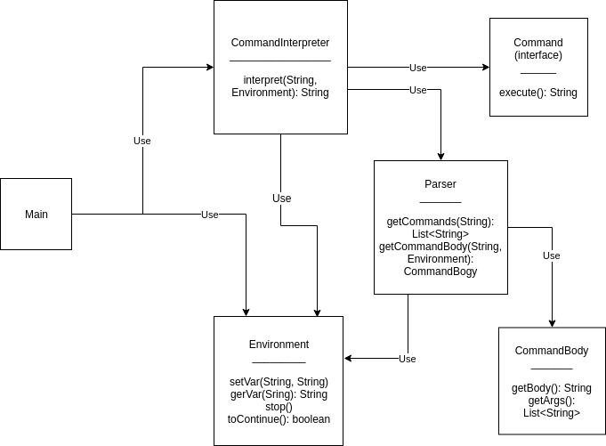

# Software-Design

`Main` - читает и выполняет команды `CommandInterpreter`, пока не будет выхода.

`CommandInterpreter` - вызывает `Parser`, подставляя в него `Environment`, после чего передает комманды в соответвующий `Command`.

`Environment` - хранит окружение.

`Parser` - по строке возвращает правильную команду (в виде набора строк).

`CommandBody` - вспомогательная структура для тела команды (сама команда + ее аргументы).

`Command` - интерфейс, соответсвующий команде.

## Выбор библиотеки

Для парсинга ключей команды `grep` использовалась библиотека `commons-cli`. Также рассматривались варианты `args4j` и 
`Jargs`. `commons-cli` имел необходимый функционал и при этом его синтаксис показался мне наиболее
приятным, поэтому выбор и пал на него.